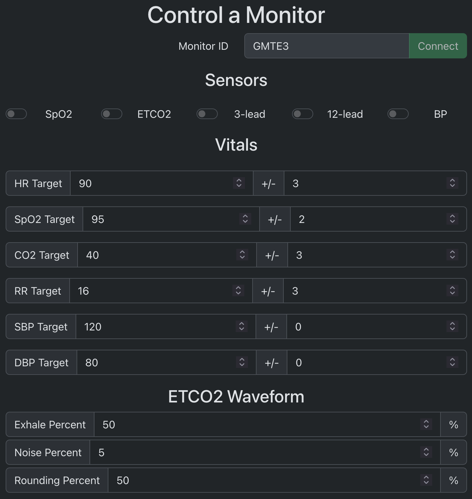
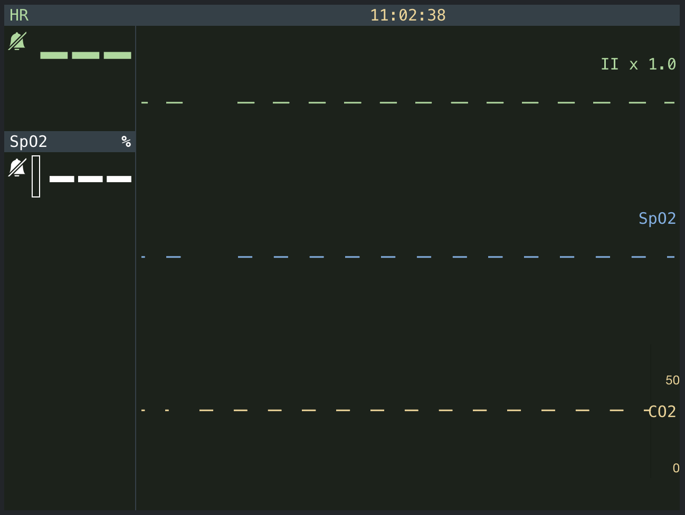
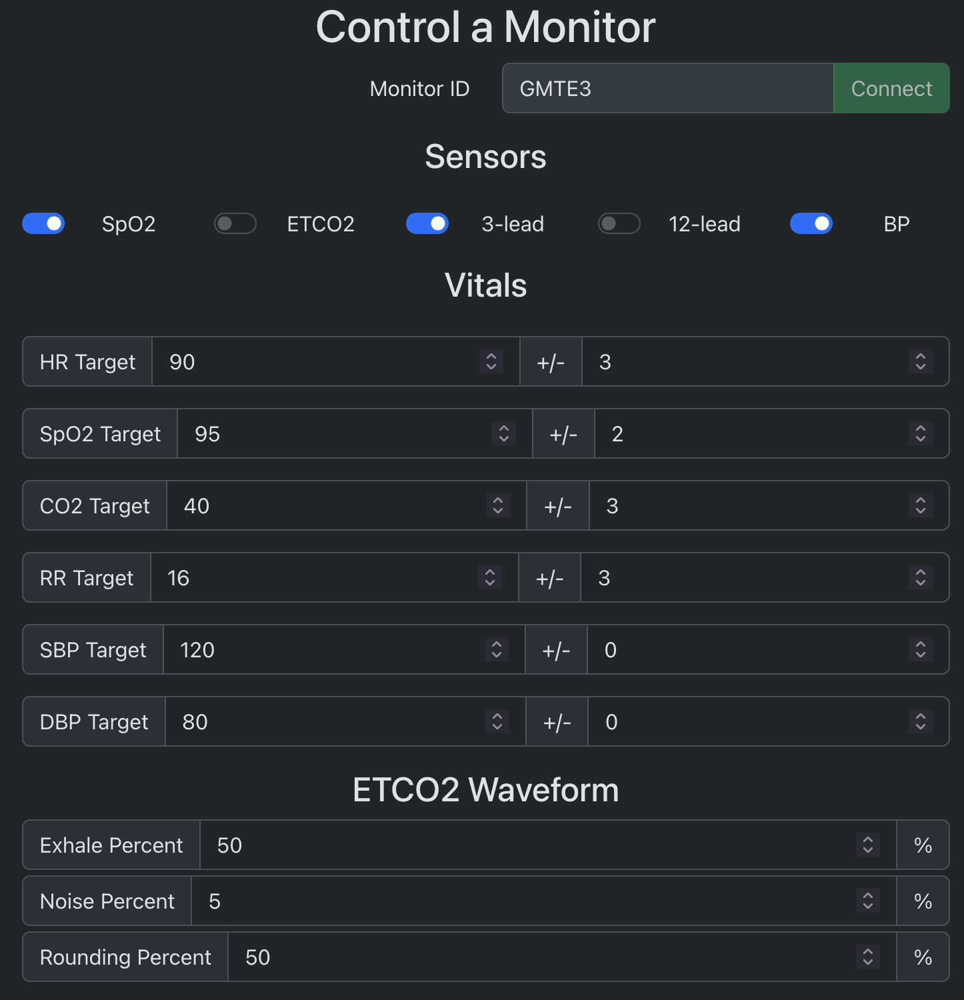
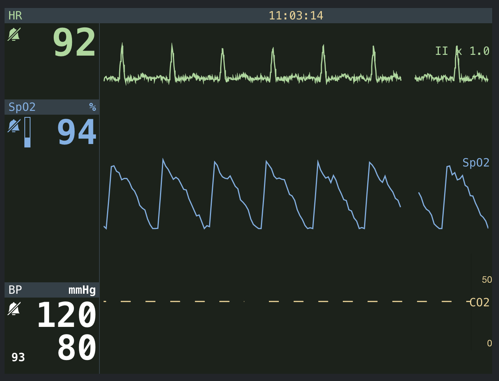

# LifePak 15 Training Simulator

This is a [Next.js](https://nextjs.org) project bootstrapped with [`create-next-app`](https://nextjs.org/docs/app/api-reference/cli/create-next-app).

## Background

This is an app that simulates a Physio Control LifePak 15 monitor for training purposes. This consists
of a page that will be loaded by a tablet or other small computer that displays the monitor and a page
that will be used by the trainer/simulation runner that controls the vitals that will be displayed on
the monitor.

The monitor currently supports minimal ETCO2, SPO2, and lead II waveforms.

## Getting Started

First, run the development server:

```bash
npm run dev
# or
yarn dev
# or
pnpm dev
# or
bun dev
```

Open [http://localhost:3000/monitor](http://localhost:3000/monitor) with your browser to see the monitor.
Open [http://localhost:3000/manager](http://localhost:3000/manager) with your browser to see the management UI.

## Usage

The monitor page will start by displaying an ID that should be entered into the manager page. Once the two are connected, you will see the blank state for each:




Once you turn on some sensors on the manager page, you will see the data populate on the monitor (within the parameters you have set):




## Features To Be Added
- [x] Create an AWS CDK stack that deploys the websocket server and static files on AWS
- [ ] Synchronize the SPO2 and EKG waveforms
- [ ] Add more options to simulate conditions in the SPO2 and EKG waveforms
- [ ] Add alerts to the monitor (no breaths, check SPO2 sensor, disconnected leads)
- [ ] Allow the user to change which waveforms are displayed/where
- [ ] Simulate the BP cuff completely (pressure ramp)
- [ ] Simulate auto-scheduling the BP cuff
